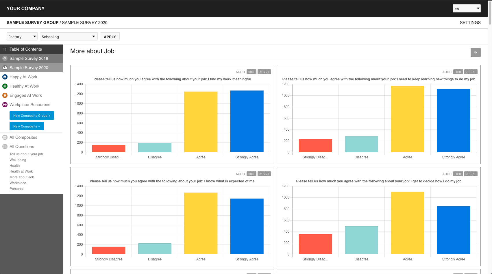

  
<a href="002-project_history.html">Project History &raquo;</a>

  
<a href="999-license.html">&laquo; License</a>

# Overview 

Survey Assure is a real-time tool designed to aggregate survey responses from various data sources (for example, [Qualtrics](https://www.qualtrics.com/)), make the contents of those survey responses immutable via use of the Ethereum blockchain, and enable you to create a "presentation layer" in order to visualize those responses and analyze the data without altering it. In other words, it is designed to foster trust between companies and employees by allowing employees to know that their survey responses were not altered in any way.

- [Overview](#overview)
- [Github](#github)
- [Lexicon](#lexicon)
  - [Core Concepts](#core-concepts)
  - [Plugin System](#plugin-system)
  - [Additional Concepts](#additional-concepts)
- [Immutability](#immutability)
  - [Merkle Tree Recipe](#merkle-tree-recipe)
- [Credits & Acknowledgements](#credits--acknowledgements)
  - [People](#people)
    - [ConsenSys](#consensys)
    - [Harvard SHINE](#harvard-shine)
    - [New America](#new-america)
  - [Tools](#tools)

# Github

The GitHub repo for the project can be found <a href="https://github.com/newamericafoundation/digi_survey_assure" target="_blank">here</a>.

# Lexicon

The core aspects of the platform are as follows:

## Core Concepts 

- Survey Group: A collection of similar surveys (data can be compared in a 1-to-1 fashion).
- Survey: A collection of question groups and questions, imported from a data source.
- Question Group: a collection of questions.
- Question (chart): an individual question (chart) on a survey.
- Composite Group: A collection of composites.
- Composite: A calculation based on a Formula that produces a custom metric using multiple questions.

## Plugin System

- Formula: A type of calculation used by a composite.
- Normalizer: Integrates a data source, making 3rd party data useable within the context of Survey Assure.
- Visualizer: Integrates a frontend graphing tool (ie ChartJS), allowing Survey Assure data to be compatible with a visualizer tool.

## Additional Concepts

- Aggregates: For survey groups with multiple surveys, allows you to visualize side-by-side comparisons of similar questions.
  - Example: you may have a quarterly employee survey whereby the questions don't change, in which case you could graph them side-by-side to compare and see trends.
- Audit Layer: "Proof" layer with information on how the hash which was sent to the blockchain was calculated.
- Data Source: A 3rd party survey provider platform.
  - Example: [Qualtrics](https://www.qualtrics.com/)
- Survey Filter: a question on a survey that can be used to limit the applicable data set displayed on any chart.
  - Example: Display responses by "Female" only.
  - Example: Display responses by "Female" who work at "Location X" only.

# Immutability

Merkle trees are used to create an immutable "hash stamp" that can be used as a proof that data was not changed when it was added into Survey Assure. The "pure" representation of the data can always be found within the "Audit Layer" of the platform (click the "Audit" link on any graph); this means that even if a question is "hidden" from the interface, the data itself was still used to build the merkle tree and can be audited at any time.

## Merkle Tree Recipe

The merkle tree in this case is created using a combination of the normalized data in Survey Assure and the raw data received from your data source.

- Create an array with:
  - Response's entry within `survey_response` (with metadata removed).
  - All entries belonging to `survey_response.id` within `survey_response_answer`
- Run this array through [MerkleTreeJs](https://www.npmjs.com/package/merkletreejs)
- Send the output to the blockchain

# Credits & Acknowledgements

A very special thank you to the [US State Department](https://www.state.gov/), who's grant made the creation of Survey Assure possible, in coordination with [New America](https://www.newamerica.org/), [ConsenSys](https://consensys.net/), and [Harvard University SHINE](https://sites.sph.harvard.edu/shine/).

## People

### ConsenSys
- Engineering
  - <a href="https://github.com/jbelelieu" target="_blank">Jonathan Belelieu</a>
- Product Design
  - <a href="http://jakobhaglof.com/" target="_blank">Jakob Haglof</a>
- Product
  - Walter Jansen
  - Silvana Rodriguez
  - Amanda Cajano

### Harvard SHINE
- Heloisa Jardim
  
### New America
- Allison Price

## Tools

- [ChartJS](https://www.chartjs.org/) 
- [Foundation Icon Set](https://zurb.com/playground/foundation-icon-fonts-3)

  
<a href="002-project_history.html">Project History &raquo;</a>

  
<a href="999-license.html">&laquo; License</a>

